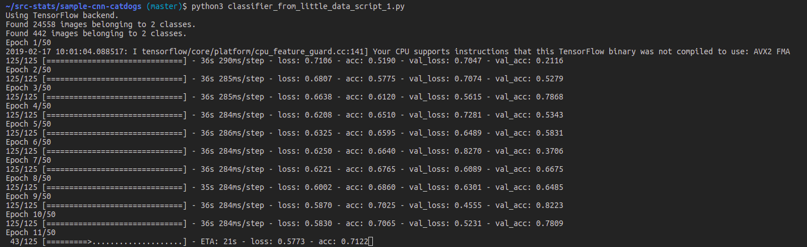

## Goal
Test implementation of cnn described in https://blog.keras.io/building-powerful-image-classification-models-using-very-little-data.html

## Downloading and prepare data
1. install kaggle command line tools https://github.com/Kaggle/kaggle-api
2. save your kaggle api key to: ~/.kaggle/kaggle.json
3. to download and organize data set:
```
$ kaggle competitions download -c dogs-vs-cats
$ ./prepare_data.sh
```
## Train
```
$ python3 classifier_from_little_data_script_1.py
```
You will see something like this:
Inline-style: 

